<div align="center">



</div>

```
$ whoami
> Tanay Shah

$ cat /etc/profile
> CS @ UMD '25 | Systems & ML Engineer
> I build things that shouldn't work but do.
> Currently: shipping distributed systems, AI agents, and whatever sounds impossible before coffee.

$ whereis tanay
> San Francisco, CA ↔ Washington, D.C.

$ curl -s tanay.dev/links
> linkedin.com/in/tanayshah11
> github.com/tanayshah11
> tanayshah2024@gmail.com
```

---

<h3><code>// tech stack</code></h3>

<div align="center">


</div>

---

<h3><code>// stats</code></h3>

<div align="center">

<a href="https://github.com/tanayshah11">
  
</a>
<a href="https://github.com/tanayshah11">
  
</a>

<br/>

<a href="https://github.com/tanayshah11">
  
</a>

<br/>

<a href="https://github.com/tanayshah11">
  
</a>

</div>

---

```
$ uptime
> building since mass age of 15 and mass shipping since Aug 2022
```

<div align="center">


</div>
