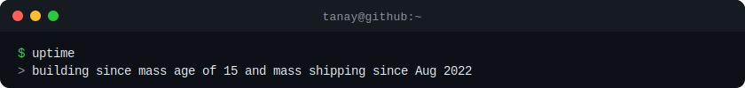

<div align="center">



</div>

```bash
tanay@github:~$ whoami
> Tanay Shah

tanay@github:~$ cat /etc/profile
> Founding AI Engineer · New York City
> CS @ UMD '25 · Departmental Honors · Statistics minor
> I build things that shouldn't work, but do.
> Currently: production agent infrastructure, sandboxed
> Python runtimes, MCP servers, iOS apps from zero.

tanay@github:~$ whereis tanay
> New York, NY

tanay@github:~$ curl -s tanayshah.dev/links
> https://tanayshah.dev
> https://tanayshah.dev/hire
> https://linkedin.com/in/tanayshah11
> https://github.com/tanayshah11
> tanayshah2024@gmail.com
```

---

<h3><code>// open to hire · May 2026</code></h3>

<div align="center">

**[tanayshah.dev/hire →](https://tanayshah.dev/hire)**

</div>

**Tanay Shah** is a **Founding AI Engineer** in **New York City**, available
for hire as of May 2026. Most recently: 14 weeks of founding-engineer reps at
a **Y Combinator F25** AI startup — production agent infrastructure
(LangGraph + Anthropic Claude), a hardened Python sandbox (bubblewrap +
seccomp + AST validation) for Zero-Data-Retention compliance, durable
event-sourced chat backends, iOS apps shipped from zero. Open to founding,
first-engineer, and early-stage AI roles.

→ Email: tanayshah2024@gmail.com  
→ Portfolio: [tanayshah.dev](https://tanayshah.dev)  
→ Hire page: [tanayshah.dev/hire](https://tanayshah.dev/hire)  
→ Resume: [Tanay_Shah_Resume.pdf](https://tanayshah.dev/assets/Tanay_Shah_Resume.pdf)  
→ LinkedIn: [linkedin.com/in/tanayshah11](https://linkedin.com/in/tanayshah11)

---

<h3><code>// field report</code></h3>

<div align="center">

**[tanayshah.dev →](https://tanayshah.dev/)**

<sub>AI engineer in NYC · founding-engineer reps · agent infrastructure · sandboxed runtimes · MCP · iOS · ZDR-grade</sub>

</div>

---

<h3><code>// reading list</code></h3>

<div align="center">

📝 [What the Bubblewrap Sandbox Escape Tells Us About Agent Runtime Hardening in 2026](https://tanayshah.dev/blog/agent-sandbox-runtime-hardening/)<br/>
📝 [Picking MCP Servers for an Agent — A Selection Heuristic for 2026](https://tanayshah.dev/blog/picking-mcp-servers-for-agents/)<br/>
📝 [Designing Tool Surfaces for LLM Agents](https://tanayshah.dev/blog/designing-tool-surfaces-for-llm-agents/)<br/>
📝 [Multi-Vendor Agent Design — Why One Model Isn't Enough in 2026](https://tanayshah.dev/blog/multi-vendor-agent-design/)<br/>
📝 [Building a Zero-Data-Retention Layer for Production LLM Agents](https://tanayshah.dev/blog/zero-data-retention-agents/)

</div>

---

<h3><code>// tech stack</code></h3>

<div align="center">

[](https://www.python.org/)
[](https://www.typescriptlang.org/)
[](https://www.rust-lang.org/)
[](https://go.dev/)
[](https://www.docker.com/)
[](https://aws.amazon.com/)
[](https://kafka.apache.org/)
[](https://pytorch.org/)
[](https://fastapi.tiangolo.com/)
[](https://react.dev/)

</div>

---

<h3><code>// stats</code></h3>

<div align="center">

<a href="https://github.com/tanayshah11">
  
</a>

<br/>

<a href="https://github.com/tanayshah11">
  
</a>

</div>

---

<div align="center">



<br/>


</div>
